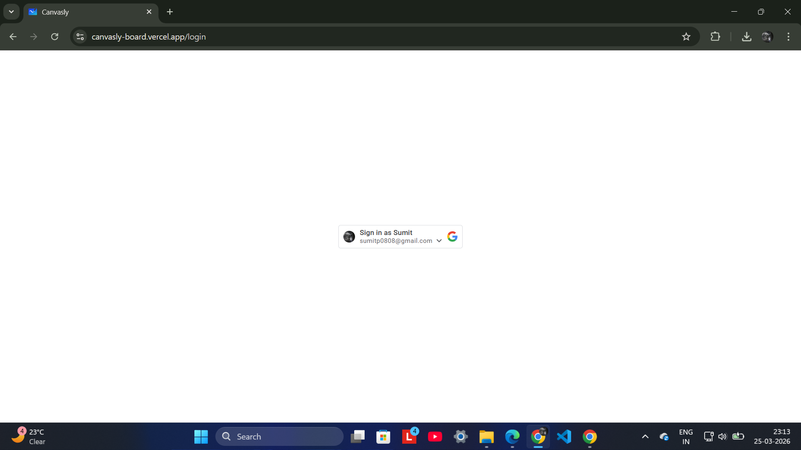
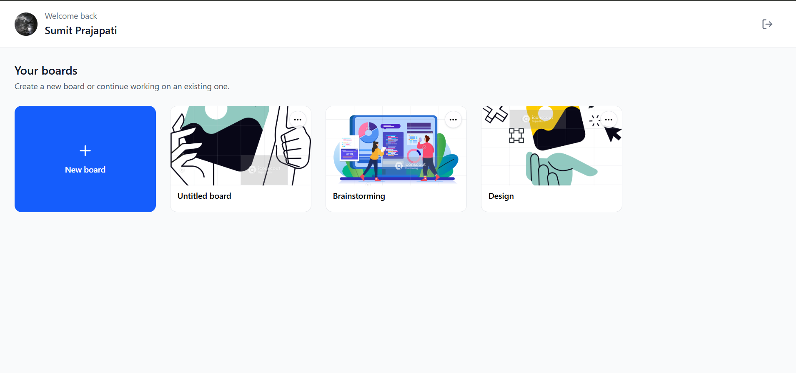
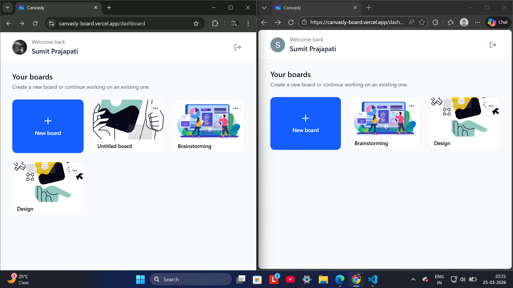
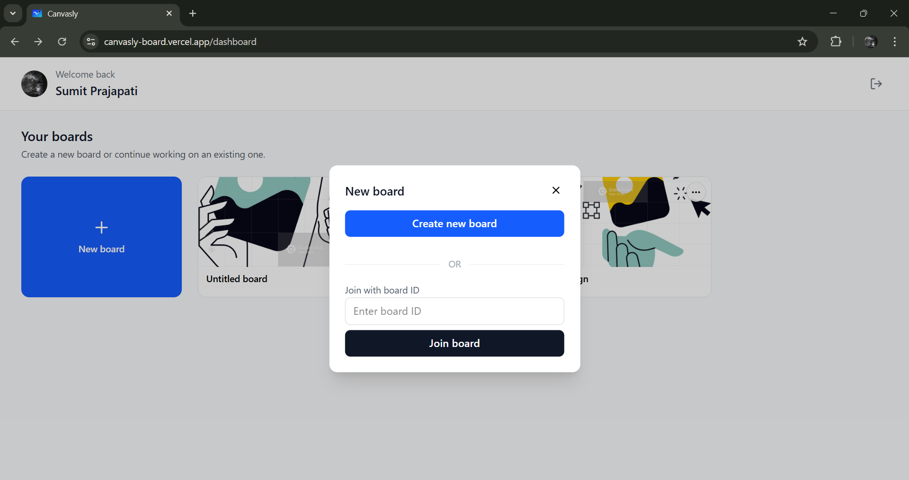
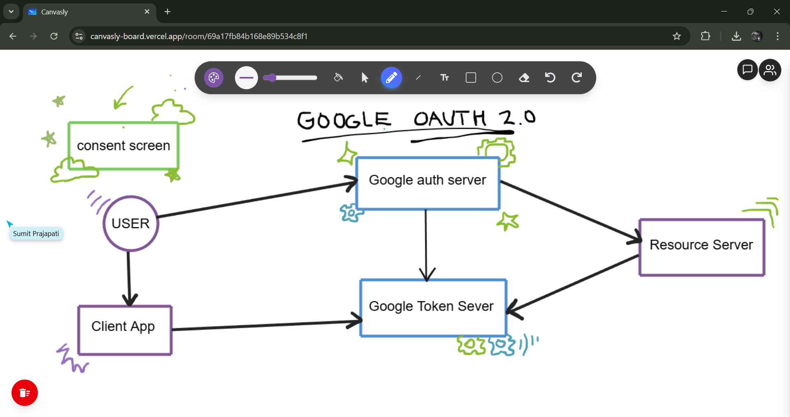
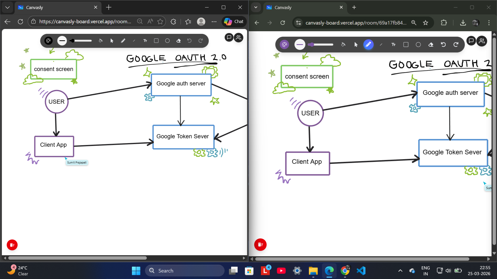
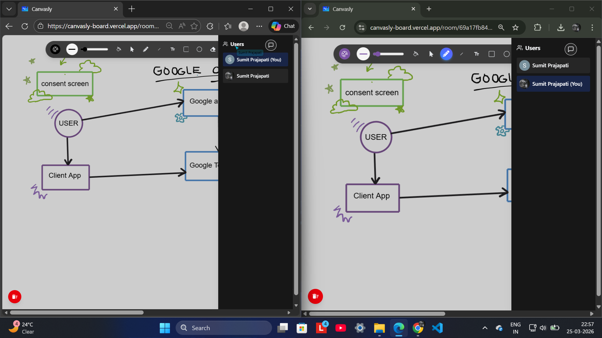
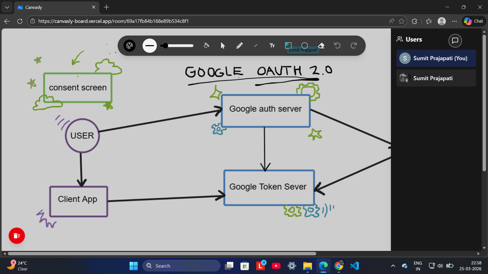
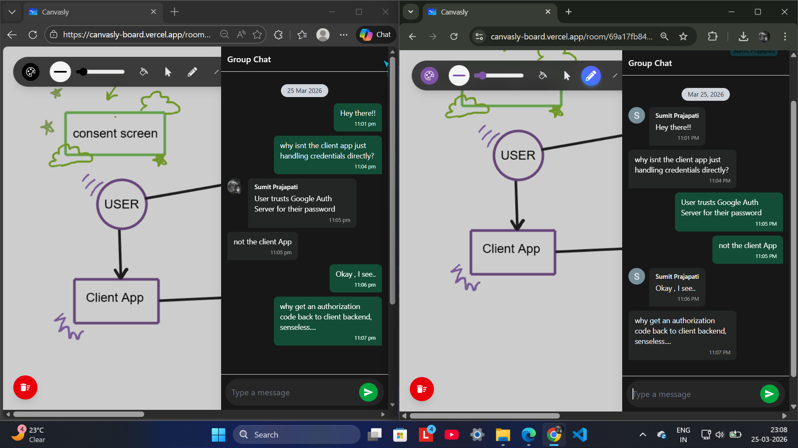
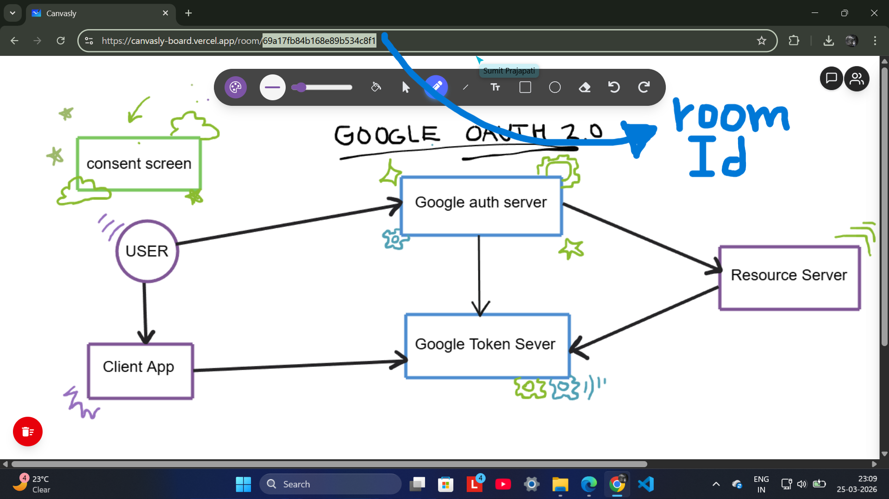

Canvasly — Real-Time Collaborative Whiteboard

Canvasly is a real-time collaborative whiteboard platform that enables multiple users to draw simultaneously, communicate through live group chat, and collaborate on shared boards using secure Google OAuth 2.0 authentication.

The application supports synchronized drawing state, live cursor tracking, room-based collaboration via shareable URLs, and persistent board access through a personalized dashboard.

Live Demo:
https://canvasly-board.vercel.app/

Repository:
https://github.com/sumitp0808/Canvasly

Features
Authentication

Secure login is implemented using Google OAuth 2.0.
Users can authenticate without managing credentials locally, ensuring industry-standard identity verification.

User Dashboard

The dashboard allows users to:

Create new whiteboards
Access previously created boards
Rejoin boards they collaborated on earlier
Join boards using a shared room ID

Shared Board Participation

Boards remain accessible to:

Board creators
Invited collaborators
Users who previously participated in a session

The split-view example below demonstrates shared board visibility across users.

Create or Join a Board

Users can create new collaborative sessions or join existing sessions using a room identifier.

Drawing Tools

Canvasly provides an interactive drawing environment supporting:

Color selection
Stroke thickness adjustment
Shape fill control
Selection and movement tool
Pencil tool
Line tool
Text insertion tool
Rectangle tool
Circle tool
Stroke eraser
Undo (Ctrl + Z)
Redo (Ctrl + Y)

Real-Time Multi-User Collaboration

Multiple users can interact with the same whiteboard simultaneously.

Canvas state is synchronized across clients using Socket.IO event broadcasting.

Active Users in Room

Each whiteboard session displays currently connected participants.

Split-view example:

Single-user panel view:

Live Group Chat

Participants inside a session can communicate through integrated real-time messaging.

Shareable Room-Based Collaboration

Each whiteboard session generates a unique room identifier embedded in the URL.
Users can invite collaborators by sharing this link.

Example:

/room/69a17fb84b168e89b534c8f1

Architecture Overview

Canvasly uses a client-server architecture combining Redux-based state management with Socket.IO event synchronization.

Core real-time operations include:

whiteboard state initialization
incremental drawing updates
cursor movement broadcasting
canvas clearing events
user presence tracking
Technology Stack
Frontend

React.js
Redux Toolkit
Tailwind CSS
Rough.js
Perfect-Freehand

Backend

Node.js
Express.js
Socket.IO

Authentication

Google OAuth 2.0

Deployment

Frontend deployed on Vercel
Backend deployed on Render

Installation

Clone the repository:

git clone https://github.com/sumitp0808/Canvasly.git

Install dependencies:

npm install

Start the frontend:

npm run dev

Start the Socket.IO server:

node index.js
Core Engineering Highlights

This project demonstrates:

Real-time distributed canvas synchronization
Collaborative multi-user interaction design
Event-driven socket communication architecture
Cursor presence broadcasting
Room-based access control using URL identifiers
Secure authentication integration using Google OAuth 2.0
State management using Redux Toolkit
Canvas rendering using Rough.js and Perfect-Freehand

Future Improvements

Possible enhancements include:

Board export support (PNG / PDF)
Granular board permissions (viewer/editor roles)
Version history tracking
Infinite canvas zoom support
Voice collaboration integration using WebRTC

Author

Sumit Prajapati
B.Tech EE MNNIT Allahabad

GitHub:
https://github.com/sumitp0808